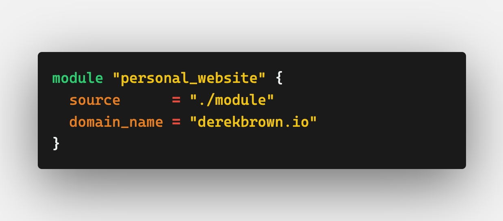
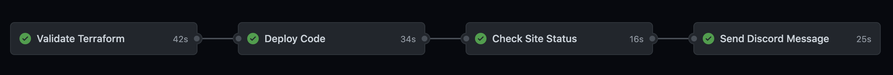

# [https://derekbrown.io](https://derekbrown.io)

This repository contains my personal website. 

- Designed with HTML5, CSS3, and Flexbox.
- Hosted in S3 fronted by CloudFront.
- Infrastructure is configured in Terraform v1.0.5 stored in S3 remote backend.
- Deployment pipeline is setup by multiple GitHub Actions.

### Terraform Module

- View the resources this module creates [here](https://github.com/derekmbrown/derekbrown-io/tree/main/infra/module).

### Deployment Pipeline

- View the Github Action workflow template for this pipeline [here](https://github.com/derekmbrown/derekbrown-io/blob/main/.github/workflows/pipeline.yaml).

